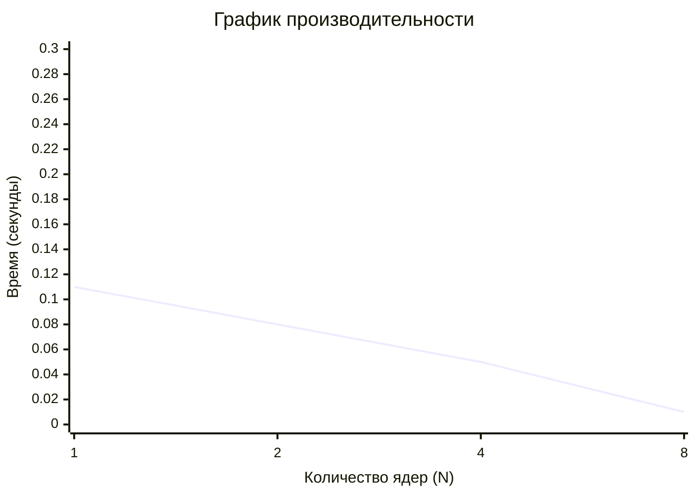

# running-MPI-on-a-supercomputer
Разработка параллельной программы умножения матриц с использованием MPI на кластере с SLURM
### Порядок выполнения лабораторной работы
- Сначала было скачано приложение VMware-Horizon для удаленного доступа к корпоративной сети университета.
- В самой сети был выполнен вход на удаленный рабочий стол корпоративной сети, установленный на Windows 7.
- Для запуска программы MPI на данный удаленный ПК были установлены 2 программы: PuTTY (для удаленного доступа к терминалу) и WinSCP (для передачи файлов с домашней директории на кластер).
- Далее в терминале был установлен модуль MPI:
```bash
module load intel/mpi4
```
- Далее была выполнена компиляция cpp файла:
```bash
mpicxx matrix_mult.cpp -o matrix_mult
```
- Далее наш скрипт, в котором указано количество используемых ядер, ограничение времени выполнения программы и т.д был запущен:
```bash
sbatch startMPI.pbs
```
- После выполнения процесса в той же папке 2024-00332 был сохранен результат программы.

### Эксперемент с разными количествами ядер
<table>
  <tr><th>Размер матрицы (N)</th><th>Время обработки (сек.)</th><th>Количество ядер (ед.)</th></tr>
  <tr><td>200</td><td>0,11</td><td>1</td></tr>
  <tr><td>200</td><td>0,08</td><td>2</td></tr>
  <tr><td>200</td><td>0,05</td><td>4</td></tr>
  <tr><td>200</td><td>0,01</td><td>8</td></tr>
</table>

### График к полученным данным

